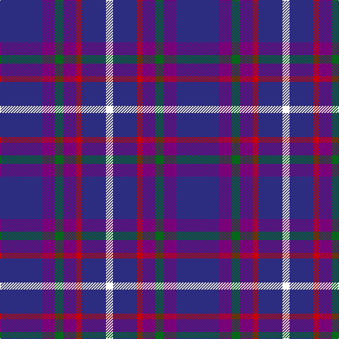

The parent of this is [Woodcock (2014)](/tartans/db/60/p18/g12/p18/r8/db34/w/10/)

This was sourced from tartans-authority.  It is a [7 stripes tartan](/stripes/stripes7/).

Original link http://www.tartansauthority.com/tartan-ferret/display/11126/

## Thread count
DB/60 P18 G12 P18 R8 DB34 W/10

## Palette
Each colour and its ΔE from the base-6 reference it is a variant of.

| Colour | Shade | Base | ΔE (OKLab) |
|---|---|---|---|
| DB |  `#2C2C80` | B  | 0.05 |
| G |  `#006818` | G  | 0.02 |
| P |  `#780078` | B  | 0.16 |
| R |  `#C80000` | R  | 0.00 |
| W |  `#FCFCFC` | W  | 0.03 |

# Sample pattern

ID: /variants/db/60/p18/g12/p18/r8/db34/w/10-db2c2c80-g006818-p780078-rc80000-wfcfcfc/
