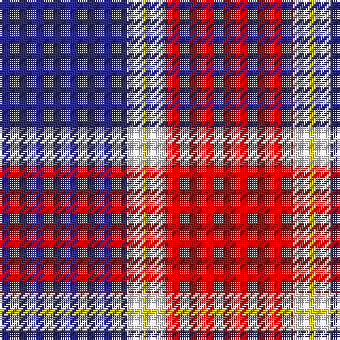

The parent of this is [Philippine Heritage (Corporate)](/tartans/db/60/w8/y2/w8/r/60/)

This was sourced from tartans-authority.  It is a [5 stripes tartan](/stripes/stripes5/).

Original link http://www.tartansauthority.com/tartan-ferret/display/10660/

## Thread count
DB/60 W8 Y2 W8 R/60

## Palette
Each colour and its ΔE from the base-6 reference it is a variant of.

| Colour | Shade | Base | ΔE (OKLab) |
|---|---|---|---|
| DB |  `#2C2C80` | B  | 0.05 |
| R |  `#C80000` | R  | 0.00 |
| W |  `#FCFCFC` | W  | 0.03 |
| Y |  `#FCCC00` | Y  | 0.04 |

# Sample pattern

ID: /variants/db/60/w8/y2/w8/r/60-db2c2c80-rc80000-wfcfcfc-yfccc00/
