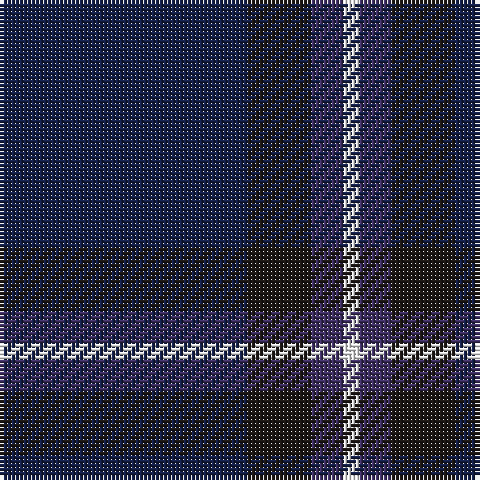

The parent of this is [Osborne, Luke Alexander (Personal)](/tartans/db/62/k16/dba8/w/4/)

This was sourced from register-of-tartans.  It is a [4 stripes tartan](/stripes/stripes4/).

Original link https://www.tartanregister.gov.uk/tartanDetails.aspx?ref=11485

## Thread count
DB/62 K16 DBa8 W/4

## Palette
Each colour and its ΔE from the base-6 reference it is a variant of.

| Colour | Shade | Base | ΔE (OKLab) |
|---|---|---|---|
| DB |  `#141E46` | B  | 0.15 |
| DBa |  `#3D2E60` | B  | 0.08 |
| K |  `#1C1714` | K  | 0.21 |
| W |  `#F8F8F8` | W  | 0.01 |

# Sample pattern

ID: /variants/db/62/k16/dba8/w/4-db141e46-dba3d2e60-k1c1714-wf8f8f8/
