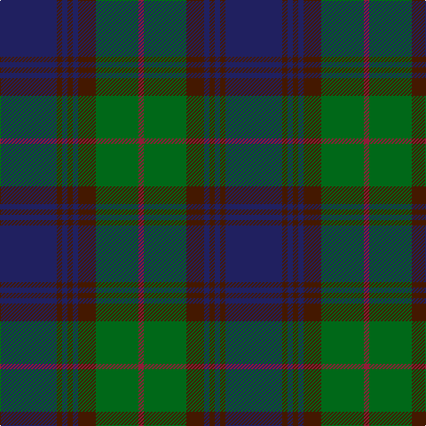

The parent of this is [Gammell Family Tartan Tartan Number: 597. Earliest known date: 1965 Designed (probably by David Thomas and Arthur Mackie of Strathmore Woollen Co) for the Hill family of Angus as a personal tartan. Tommy Gemmell (6.3.05) said "The tartan was designed using the largest Government sett by Mrs Hill's mother - a Mrs Gammell - who was a handweaver." See products available Copyright © Blair Urquhart, Comrie, 2015](/tartans/db/64/dr6/db6/dr6/db6/dr20/g48/dra/6/)

This was sourced from house-of-tartan.  It is a [8 stripes tartan](/stripes/stripes8/).

Original link http://www.house-of-tartan.scotland.net/house/TartanViewjs.asp?colr=Def&tnam=597

## Thread count
DB/64 DR6 DB6 DR6 DB6 DR20 G48 DRa/6

## Palette
Each colour and its ΔE from the base-6 reference it is a variant of.

| Colour | Shade | Base | ΔE (OKLab) |
|---|---|---|---|
| DB |  `#202060` | B  | 0.11 |
| DR |  `#441800` | B  | 0.22 |
| DRa |  `#901C38` | R  | 0.12 |
| G |  `#006818` | G  | 0.02 |

# Sample pattern

ID: /variants/db/64/dr6/db6/dr6/db6/dr20/g48/dra/6-db202060-dr441800-dra901c38-g006818/
