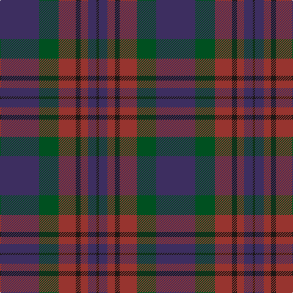

The parent of this is [Aisteach](/tartans/db/64/g32/dr28/k8/dr12/db14/k/4/)

This was sourced from register-of-tartans.  It is a [7 stripes tartan](/stripes/stripes7/).

Original link https://www.tartanregister.gov.uk/tartanDetails.aspx?ref=11406

## Thread count
DB/64 G32 DR28 K8 DR12 DB14 K/4

## Palette
Each colour and its ΔE from the base-6 reference it is a variant of.

| Colour | Shade | Base | ΔE (OKLab) |
|---|---|---|---|
| DB |  `#3D2E60` | B  | 0.08 |
| DR |  `#97342F` | R  | 0.10 |
| G |  `#005020` | G  | 0.08 |
| K |  `#1C1714` | K  | 0.21 |

# Sample pattern

ID: /variants/db/64/g32/dr28/k8/dr12/db14/k/4-db3d2e60-dr97342f-g005020-k1c1714/
