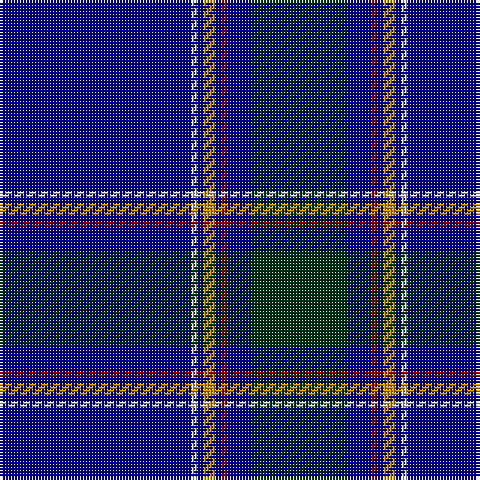

The parent of this is [Royal Agricultural Winter Fair (Comm](/tartans/db/64/n2/db2/dy4/db2/dr2/db8/dg/32/)

This was sourced from tartans-authority.  It is a [8 stripes tartan](/stripes/stripes8/).

Original link http://www.tartansauthority.com/tartan-ferret/display/5408/

## Thread count
DB/64 N2 DB2 DY4 DB2 DR2 DB8 DG/32

## Palette
Each colour and its ΔE from the base-6 reference it is a variant of.

| Colour | Shade | Base | ΔE (OKLab) |
|---|---|---|---|
| DB |  `#00008C` | B  | 0.13 |
| DG |  `#003014` | G  | 0.18 |
| DR |  `#8C0000` | R  | 0.13 |
| DY |  `#C88C00` | Y  | 0.15 |
| N |  `#C8C8C8` | W  | 0.13 |

# Sample pattern

ID: /variants/db/64/n2/db2/dy4/db2/dr2/db8/dg/32-db00008c-dg003014-dr8c0000-dyc88c00-nc8c8c8/
