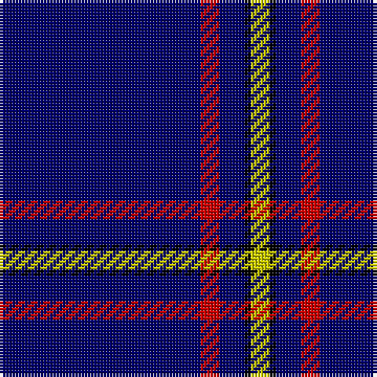

The parent of this is [MacLaine of Lochbuie Hunting](/tartans/db/64/r6/db8/k2/y/6/)

This was sourced from weddslist.  It is a [5 stripes tartan](/stripes/stripes5/).

Original link http://www.weddslist.com/cgi-bin/tartans/pg.pl?source=rb

## Thread count
DB/64 R6 DB8 K2 Y/6

## Palette
Each colour and its ΔE from the base-6 reference it is a variant of.

| Colour | Shade | Base | ΔE (OKLab) |
|---|---|---|---|
| DB |  `#00006B` | B  | 0.16 |
| K |  `#000000` | K  | 0.00 |
| R |  `#C80000` | R  | 0.00 |
| Y |  `#C8C800` | Y  | 0.05 |

# Sample pattern

ID: /variants/db/64/r6/db8/k2/y/6-db00006b-k000000-rc80000-yc8c800/
