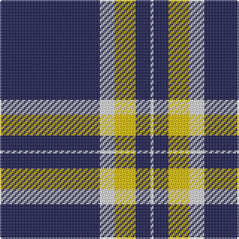

The parent of this is [St. John (Corporate?)](/tartans/db/67/ln10/y14/db10/ln/2/)

This was sourced from tartans-authority.  It is a [5 stripes tartan](/stripes/stripes5/).

Original link http://www.tartansauthority.com/tartan-ferret/display/8146/

## Thread count
DB/67 LN10 Y14 DB10 LN/2

## Palette
Each colour and its ΔE from the base-6 reference it is a variant of.

| Colour | Shade | Base | ΔE (OKLab) |
|---|---|---|---|
| DB |  `#1C1C50` | B  | 0.14 |
| LN |  `#E0E0E0` | W  | 0.06 |
| Y |  `#E8C000` | Y  | 0.00 |

# Sample pattern

ID: /variants/db/67/ln10/y14/db10/ln/2-db1c1c50-lne0e0e0-ye8c000/
