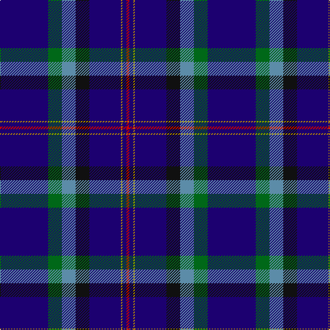

The parent of this is [Lapsley, The Tom (Personal)](/tartans/db/70/g20/b20/k20/db46/dy2/db6/r/4/)

This was sourced from tartans-authority.  It is a [8 stripes tartan](/stripes/stripes8/).

Original link http://www.tartansauthority.com/tartan-ferret/display/10599/

## Thread count
DB/70 G20 B20 K20 DB46 DY2 DB6 R/4

## Palette
Each colour and its ΔE from the base-6 reference it is a variant of.

| Colour | Shade | Base | ΔE (OKLab) |
|---|---|---|---|
| B |  `#5C8CA8` | B  | 0.23 |
| DB |  `#1C0070` | B  | 0.14 |
| DY |  `#BC8C00` | Y  | 0.16 |
| G |  `#006818` | G  | 0.02 |
| K |  `#101010` | K  | 0.17 |
| R |  `#C80000` | R  | 0.00 |

# Sample pattern

ID: /variants/db/70/g20/b20/k20/db46/dy2/db6/r/4-b5c8ca8-db1c0070-dybc8c00-g006818-k101010-rc80000/
