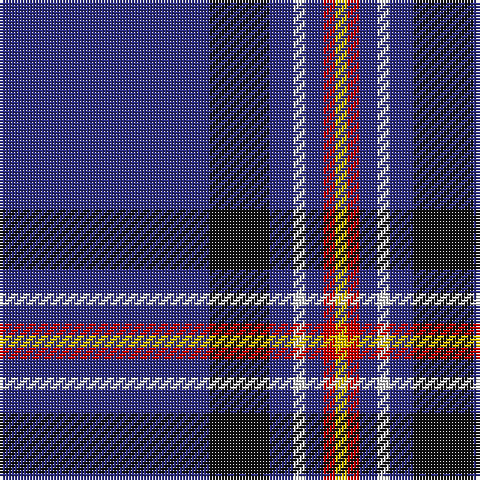

The parent of this is [Laidlaw's Highland Drovers (Corp)](/tartans/db/70/k20/db8/ln4/db6/r4/y/4/)

This was sourced from tartans-authority.  It is a [7 stripes tartan](/stripes/stripes7/).

Original link http://www.tartansauthority.com/tartan-ferret/display/2127/

## Thread count
DB/70 K20 DB8 LN4 DB6 R4 Y/4

## Palette
Each colour and its ΔE from the base-6 reference it is a variant of.

| Colour | Shade | Base | ΔE (OKLab) |
|---|---|---|---|
| DB |  `#2C2C80` | B  | 0.05 |
| K |  `#101010` | K  | 0.17 |
| LN |  `#E0E0E0` | W  | 0.06 |
| R |  `#C80000` | R  | 0.00 |
| Y |  `#E8C000` | Y  | 0.00 |

# Sample pattern

ID: /variants/db/70/k20/db8/ln4/db6/r4/y/4-db2c2c80-k101010-lne0e0e0-rc80000-ye8c000/
