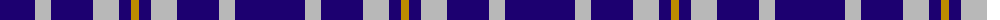

The parent of this is [Auchterlonie (Name)](/tartans/db/70/n16/db42/n26/db12/dy/8/)

This was sourced from tartans-authority.  It is a [6 stripes tartan](/stripes/stripes6/).

Original link http://www.tartansauthority.com/tartan-ferret/display/2677/

## Thread count
DB/70 N16 DB42 N26 DB12 DY/8

## Palette
Each colour and its ΔE from the base-6 reference it is a variant of.

| Colour | Shade | Base | ΔE (OKLab) |
|---|---|---|---|
| DB |  `#1C0070` | B  | 0.14 |
| DY |  `#BC8C00` | Y  | 0.16 |
| N |  `#B8B8B8` | Y  | 0.17 |

# Sample pattern

ID: /variants/db/70/n16/db42/n26/db12/dy/8-db1c0070-dybc8c00-nb8b8b8/
