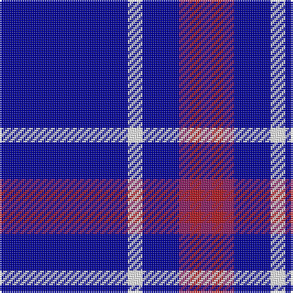

The parent of this is [Steffen, Markus (Personal)](/tartans/db/70/w8/db20/p6/r6/p/6/)

This was sourced from register-of-tartans.  It is a [6 stripes tartan](/stripes/stripes6/).

Original link https://www.tartanregister.gov.uk/tartanDetails.aspx?ref=10448

## Thread count
DB/70 W8 DB20 P6 R6 P/6

## Palette
Each colour and its ΔE from the base-6 reference it is a variant of.

| Colour | Shade | Base | ΔE (OKLab) |
|---|---|---|---|
| DB |  `#00009C` | B  | 0.13 |
| P |  `#8B1C62` | R  | 0.17 |
| R |  `#B0171F` | R  | 0.05 |
| W |  `#FFFFFF` | W  | 0.03 |

# Sample pattern

ID: /variants/db/70/w8/db20/p6/r6/p/6-db00009c-p8b1c62-rb0171f-wffffff/
