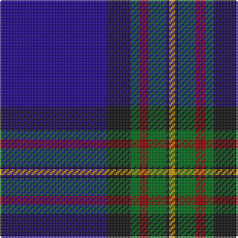

The parent of this is [MacLaurin of Broich (Clan)](/tartans/db/72/k16/g6/dr6/g12/k2/dy/4/)

This was sourced from tartans-authority.  It is a [7 stripes tartan](/stripes/stripes7/).

Original link http://www.tartansauthority.com/tartan-ferret/display/344/

## Thread count
DB/72 K16 G6 DR6 G12 K2 DY/4

## Palette
Each colour and its ΔE from the base-6 reference it is a variant of.

| Colour | Shade | Base | ΔE (OKLab) |
|---|---|---|---|
| DB |  `#200088` | B  | 0.12 |
| DR |  `#880000` | R  | 0.14 |
| DY |  `#D09800` | Y  | 0.11 |
| G |  `#006818` | G  | 0.02 |
| K |  `#101010` | K  | 0.17 |

# Sample pattern

ID: /variants/db/72/k16/g6/dr6/g12/k2/dy/4-db200088-dr880000-dyd09800-g006818-k101010/
