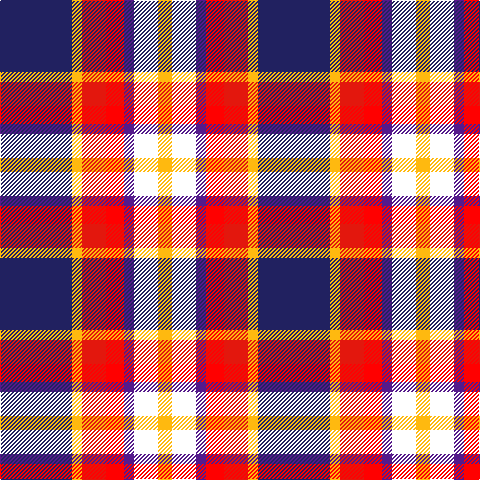

The parent of this is [Galvez-Brown Name Tartan Tartan Number: 10693. Earliest known date: 6 September 2012 This tartan celebrates the union of the Galvez and Brown families, of Catalan and Scottish origins, and may be used by any of the descendants or relatives of both families. Colours: blue and white represent the Saltire (Scottish Flag); red and yellow represent the colours of the Senyera (Catalan Flag). It was designed using the Tartan Web Designer software. See products available Copyright © Blair Urquhart, Comrie, 2015](/tartans/db/72/y10/r24/ra18/p10/w24/y/14/)

This was sourced from house-of-tartan.  It is a [7 stripes tartan](/stripes/stripes7/).

Original link http://www.house-of-tartan.scotland.net/house/TartanViewjs.asp?colr=Def&tnam=10693

## Thread count
DB/72 Y10 R24 Ra18 P10 W24 Y/14

## Palette
Each colour and its ΔE from the base-6 reference it is a variant of.

| Colour | Shade | Base | ΔE (OKLab) |
|---|---|---|---|
| DB |  `#212160` | B  | 0.10 |
| P |  `#551A8B` | B  | 0.10 |
| R |  `#E3170D` | R  | 0.06 |
| Ra |  `#FF0000` | R  | 0.11 |
| W |  `#FFFFFF` | W  | 0.03 |
| Y |  `#FFB90F` | Y  | 0.04 |

# Sample pattern

ID: /variants/db/72/y10/r24/ra18/p10/w24/y/14-db212160-p551a8b-re3170d-raff0000-wffffff-yffb90f/
