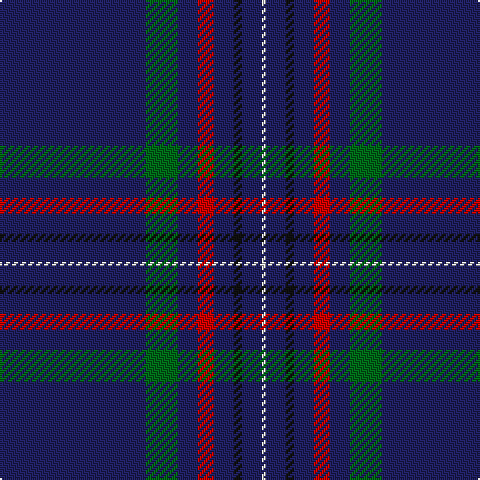

The parent of this is [Scotch Whisky Heritage Corporate Tartan Tartan Number: 1920. Earliest known date: 1987 Half actual count for display. See products available Copyright © Blair Urquhart, Comrie, 2015](/tartans/db/73/g16/db10/r8/db10/k4/db10/ln/2/)

This was sourced from house-of-tartan.  It is a [8 stripes tartan](/stripes/stripes8/).

Original link http://www.house-of-tartan.scotland.net/house/TartanViewjs.asp?colr=Def&tnam=1920

## Thread count
DB/73 G16 DB10 R8 DB10 K4 DB10 LN/2

## Palette
Each colour and its ΔE from the base-6 reference it is a variant of.

| Colour | Shade | Base | ΔE (OKLab) |
|---|---|---|---|
| DB |  `#202060` | B  | 0.11 |
| G |  `#006818` | G  | 0.02 |
| K |  `#101010` | K  | 0.17 |
| LN |  `#E0E0E0` | W  | 0.06 |
| R |  `#C80000` | R  | 0.00 |

# Sample pattern

ID: /variants/db/73/g16/db10/r8/db10/k4/db10/ln/2-db202060-g006818-k101010-lne0e0e0-rc80000/
