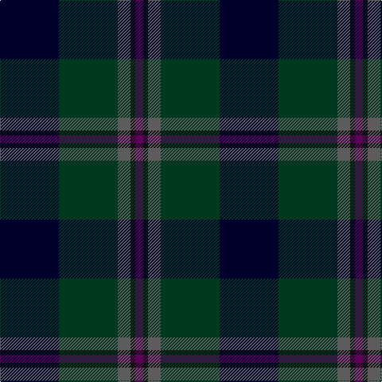

The parent of this is [Dallard (Personal)](/tartans/db/74/dg74/n16/k6/p/10/)

This was sourced from tartans-authority.  It is a [5 stripes tartan](/stripes/stripes5/).

Original link http://www.tartansauthority.com/tartan-ferret/display/7424/

## Thread count
DB/74 DG74 N16 K6 P/10

## Palette
Each colour and its ΔE from the base-6 reference it is a variant of.

| Colour | Shade | Base | ΔE (OKLab) |
|---|---|---|---|
| DB |  `#00002C` | K  | 0.16 |
| DG |  `#003820` | G  | 0.16 |
| K |  `#101010` | K  | 0.17 |
| N |  `#5C5C5C` | B  | 0.14 |
| P |  `#5C005C` | B  | 0.15 |

# Sample pattern

ID: /variants/db/74/dg74/n16/k6/p/10-db00002c-dg003820-k101010-n5c5c5c-p5c005c/
