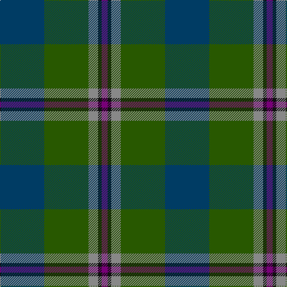

The parent of this is [Dallard Personal Tartan Tartan Number: 7424. Earliest known date: 2007 The material was going towards a kilt for my wedding in June 2008. See products available Copyright © Blair Urquhart, Comrie, 2015](/tartans/db/74/g74/n16/k6/p/10/)

This was sourced from house-of-tartan.  It is a [5 stripes tartan](/stripes/stripes5/).

Original link http://www.house-of-tartan.scotland.net/house/TartanViewjs.asp?colr=Def&tnam=7424

## Thread count
DB/74 G74 N16 K6 P/10

## Palette
Each colour and its ΔE from the base-6 reference it is a variant of.

| Colour | Shade | Base | ΔE (OKLab) |
|---|---|---|---|
| DB |  `#003C64` | B  | 0.07 |
| G |  `#285800` | G  | 0.04 |
| K |  `#101010` | K  | 0.17 |
| N |  `#888888` | R  | 0.24 |
| P |  `#780078` | B  | 0.16 |

# Sample pattern

ID: /variants/db/74/g74/n16/k6/p/10-db003c64-g285800-k101010-n888888-p780078/
