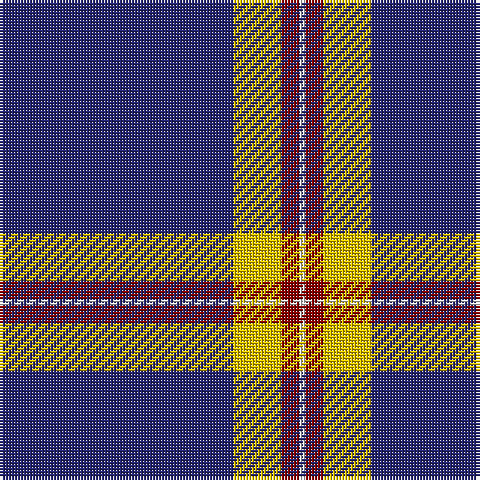

The parent of this is [Norwich University Regimental Tartan Tartan Number: 10631. Earliest known date: 2012 The tartan was designed for use by the Norwich University Pipes and Drums Band primarily in kilts. The blue is from the Corps of Cadets formal attire coatee and the University colors are maroon and gold See products available Copyright © Blair Urquhart, Comrie, 2015](/tartans/db/78/y16/dr6/ln/2/)

This was sourced from house-of-tartan.  It is a [4 stripes tartan](/stripes/stripes4/).

Original link http://www.house-of-tartan.scotland.net/house/TartanViewjs.asp?colr=Def&tnam=10631

## Thread count
DB/78 Y16 DR6 LN/2

## Palette
Each colour and its ΔE from the base-6 reference it is a variant of.

| Colour | Shade | Base | ΔE (OKLab) |
|---|---|---|---|
| DB |  `#242470` | B  | 0.08 |
| DR |  `#880000` | R  | 0.14 |
| LN |  `#E0E0E0` | W  | 0.06 |
| Y |  `#E8C000` | Y  | 0.00 |

# Sample pattern

ID: /variants/db/78/y16/dr6/ln/2-db242470-dr880000-lne0e0e0-ye8c000/
