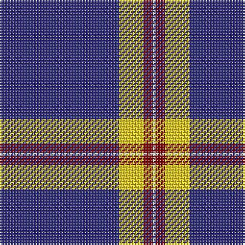

The parent of this is [Norwich University (Corporate)](/tartans/db/78/y16/dr6/w/2/)

This was sourced from tartans-authority.  It is a [4 stripes tartan](/stripes/stripes4/).

Original link http://www.tartansauthority.com/tartan-ferret/display/10631/

## Thread count
DB/78 Y16 DR6 W/2

## Palette
Each colour and its ΔE from the base-6 reference it is a variant of.

| Colour | Shade | Base | ΔE (OKLab) |
|---|---|---|---|
| DB |  `#2C2C80` | B  | 0.05 |
| DR |  `#880000` | R  | 0.14 |
| W |  `#FCFCFC` | W  | 0.03 |
| Y |  `#FCCC00` | Y  | 0.04 |

# Sample pattern

ID: /variants/db/78/y16/dr6/w/2-db2c2c80-dr880000-wfcfcfc-yfccc00/
