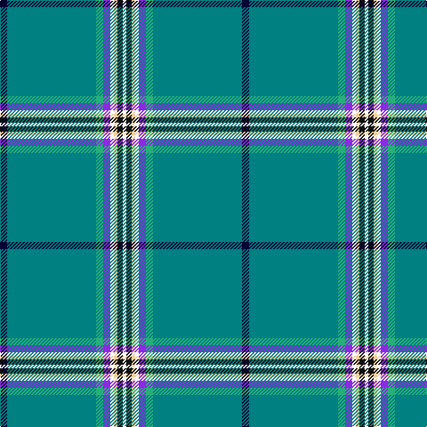

The parent of this is [Glasgow Islay, The](/tartans/db/8/b100/ba8/p8/w4/lr4/k6/w/4/)

This was sourced from register-of-tartans.  It is a [8 stripes tartan](/stripes/stripes8/).

Original link https://www.tartanregister.gov.uk/tartanDetails.aspx?ref=10217

## Thread count
DB/8 B100 Ba8 P8 W4 LR4 K6 W/4

## Palette
Each colour and its ΔE from the base-6 reference it is a variant of.

| Colour | Shade | Base | ΔE (OKLab) |
|---|---|---|---|
| B |  `#008080` | G  | 0.16 |
| Ba |  `#28AE7B` | Y  | 0.23 |
| DB |  `#000033` | K  | 0.18 |
| K |  `#101010` | K  | 0.17 |
| LR |  `#EECFA1` | Y  | 0.11 |
| P |  `#8A2BE2` | B  | 0.22 |
| W |  `#FFFFFF` | W  | 0.03 |

# Sample pattern

ID: /variants/db/8/b100/ba8/p8/w4/lr4/k6/w/4-b008080-ba28ae7b-db000033-k101010-lreecfa1-p8a2be2-wffffff/
