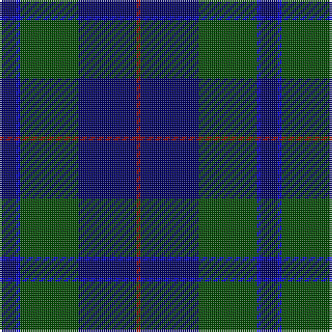

The parent of this is [Wcwm 1255-1](/tartans/db/8/b2/g28/db28/dr/2/)

This was sourced from register-of-tartans.  It is a [5 stripes tartan](/stripes/stripes5/).

Original link https://www.tartanregister.gov.uk/tartanDetails.aspx?ref=4517

## Thread count
DB/8 B2 G28 DB28 DR/2

## Palette
Each colour and its ΔE from the base-6 reference it is a variant of.

| Colour | Shade | Base | ΔE (OKLab) |
|---|---|---|---|
| B |  `#0000E0` | B  | 0.17 |
| DB |  `#000064` | B  | 0.17 |
| DR |  `#8C0000` | R  | 0.13 |
| G |  `#004C00` | G  | 0.08 |

# Sample pattern

ID: /variants/db/8/b2/g28/db28/dr/2-b0000e0-db000064-dr8c0000-g004c00/
