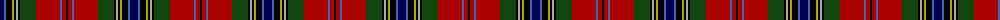

The parent of this is [MacLean](/tartans/db/8/b2/k6/lg2/k2/n2/k2/dg16/dr24/b2/dr4/k/2/)

This was sourced from weddslist.  It is a [12 stripes tartan](/stripes/stripes12/).

Original link http://www.weddslist.com/cgi-bin/tartans/pg.pl?source=x

## Thread count
DB/8 B2 K6 LG2 K2 N2 K2 DG16 DR24 B2 DR4 K/2

## Palette
Each colour and its ΔE from the base-6 reference it is a variant of.

| Colour | Shade | Base | ΔE (OKLab) |
|---|---|---|---|
| B |  `#4367AE` | B  | 0.13 |
| DB |  `#000052` | B  | 0.20 |
| DG |  `#11450D` | G  | 0.10 |
| DR |  `#AA0000` | R  | 0.06 |
| K |  `#000000` | K  | 0.00 |
| LG |  `#AAAA00` | Y  | 0.11 |
| N |  `#AAAAAA` | Y  | 0.19 |

ID: /variants/db/8/b2/k6/lg2/k2/n2/k2/dg16/dr24/b2/dr4/k/2-b4367ae-db000052-dg11450d-draa0000-k000000-lgaaaa00-naaaaaa/
