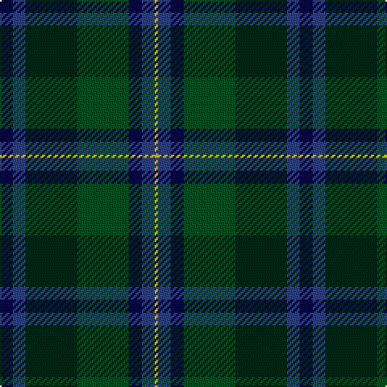

The parent of this is [Unidentified Waistcoat](/tartans/db/8/b8/dg32/g32/db8/b8/y/2/)

This was sourced from register-of-tartans.  It is a [7 stripes tartan](/stripes/stripes7/).

Original link https://www.tartanregister.gov.uk/tartanDetails.aspx?ref=4392

## Thread count
DB/8 B8 DG32 G32 DB8 B8 Y/2

## Palette
Each colour and its ΔE from the base-6 reference it is a variant of.

| Colour | Shade | Base | ΔE (OKLab) |
|---|---|---|---|
| B |  `#2C4084` | B  | 0.00 |
| DB |  `#080848` | B  | 0.19 |
| DG |  `#002814` | B  | 0.21 |
| G |  `#005020` | G  | 0.08 |
| Y |  `#E8C000` | Y  | 0.00 |

# Sample pattern

ID: /variants/db/8/b8/dg32/g32/db8/b8/y/2-b2c4084-db080848-dg002814-g005020-ye8c000/
