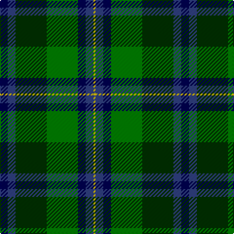

The parent of this is [Unidentified, Waistcoat](/tartans/db/8/b8/dg32/g32/db8/b8/y/2/)

This was sourced from weddslist.  It is a [7 stripes tartan](/stripes/stripes7/).

Original link http://www.weddslist.com/cgi-bin/tartans/pg.pl?source=sts

## Thread count
DB/8 B8 DG32 G32 DB8 B8 Y/2

## Palette
Each colour and its ΔE from the base-6 reference it is a variant of.

| Colour | Shade | Base | ΔE (OKLab) |
|---|---|---|---|
| B |  `#304080` | B  | 0.01 |
| DB |  `#000050` | B  | 0.20 |
| DG |  `#003000` | G  | 0.18 |
| G |  `#008000` | G  | 0.09 |
| Y |  `#F0C000` | Y  | 0.01 |

# Sample pattern

ID: /variants/db/8/b8/dg32/g32/db8/b8/y/2-b304080-db000050-dg003000-g008000-yf0c000/
