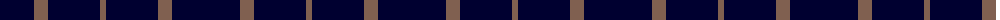

The parent of this is [Crombie House Check](/tartans/db/8/db24/db6/lt14/db52/lt/6/)

This was sourced from weddslist.  It is a [6 stripes tartan](/stripes/stripes6/).

Original link http://www.weddslist.com/cgi-bin/tartans/pg.pl?source=sts

## Thread count
DB/8 DB24 DB6 LT14 DB52 LT/6

## Palette
Each colour and its ΔE from the base-6 reference it is a variant of.

| Colour | Shade | Base | ΔE (OKLab) |
|---|---|---|---|
| DB |  `#000030` | K  | 0.17 |
| LT |  `#806050` | R  | 0.17 |

# Sample pattern

ID: /variants/db/8/db24/db6/lt14/db52/lt/6-db000030-lt806050/
