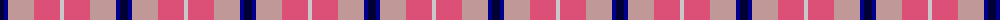
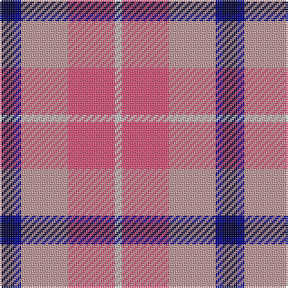

The parent of this is [Think Pink (Corporate)](/tartans/db/8/dba4/n26/lr26/na/4/)

This was sourced from tartans-authority.  It is a [5 stripes tartan](/stripes/stripes5/).

Original link http://www.tartansauthority.com/tartan-ferret/display/5134/

## Thread count
DB/8 DBa4 N26 LR26 Na/4

## Palette
Each colour and its ΔE from the base-6 reference it is a variant of.

| Colour | Shade | Base | ΔE (OKLab) |
|---|---|---|---|
| DB |  `#000034` | K  | 0.18 |
| DBa |  `#00008C` | B  | 0.13 |
| LR |  `#DC5078` | R  | 0.14 |
| N |  `#C09898` | Y  | 0.19 |
| Na |  `#C8C8C8` | W  | 0.13 |

# Sample pattern

ID: /variants/db/8/dba4/n26/lr26/na/4-db000034-dba00008c-lrdc5078-nc09898-nac8c8c8/
