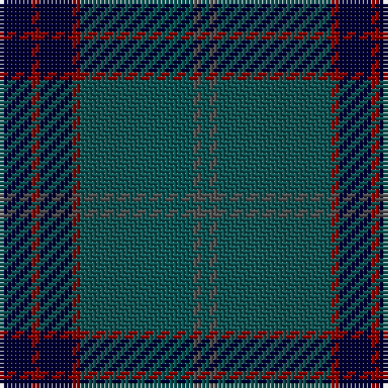

The parent of this is [Pinehurst Resort (Corporate)](/tartans/db/8/dr2/db8/dr2/g28/n2/g/2/)

This was sourced from tartans-authority.  It is a [7 stripes tartan](/stripes/stripes7/).

Original link http://www.tartansauthority.com/tartan-ferret/display/4173/

## Thread count
DB/8 DR2 DB8 DR2 G28 N2 G/2

## Palette
Each colour and its ΔE from the base-6 reference it is a variant of.

| Colour | Shade | Base | ΔE (OKLab) |
|---|---|---|---|
| DB |  `#000034` | K  | 0.18 |
| DR |  `#8C0000` | R  | 0.13 |
| G |  `#0C5454` | B  | 0.12 |
| N |  `#505050` | B  | 0.12 |

# Sample pattern

ID: /variants/db/8/dr2/db8/dr2/g28/n2/g/2-db000034-dr8c0000-g0c5454-n505050/
