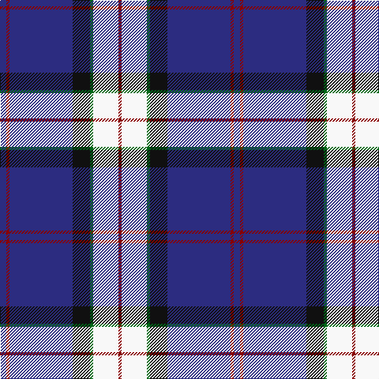

The parent of this is [Sinclair, Blue (Personal)](/tartans/db/8/dr4/db80/k22/g4/w32/dr/4/)

This was sourced from tartans-authority.  It is a [7 stripes tartan](/stripes/stripes7/).

Original link http://www.tartansauthority.com/tartan-ferret/display/2047/

## Thread count
DB/8 DR4 DB80 K22 G4 W32 DR/4

## Palette
Each colour and its ΔE from the base-6 reference it is a variant of.

| Colour | Shade | Base | ΔE (OKLab) |
|---|---|---|---|
| DB |  `#2C2C80` | B  | 0.05 |
| DR |  `#880000` | R  | 0.14 |
| G |  `#006818` | G  | 0.02 |
| K |  `#101010` | K  | 0.17 |
| W |  `#F8F8F8` | W  | 0.01 |

# Sample pattern

ID: /variants/db/8/dr4/db80/k22/g4/w32/dr/4-db2c2c80-dr880000-g006818-k101010-wf8f8f8/
