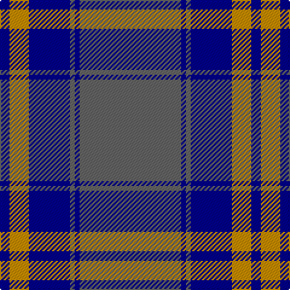

The parent of this is [Connecticut State Police PB (Cor.)](/tartans/db/8/dy16/dba34/n4/dba4/n/84/)

This was sourced from tartans-authority.  It is a [6 stripes tartan](/stripes/stripes6/).

Original link http://www.tartansauthority.com/tartan-ferret/display/4143/

## Thread count
DB/8 DY16 DBa34 N4 DBa4 N/84

## Palette
Each colour and its ΔE from the base-6 reference it is a variant of.

| Colour | Shade | Base | ΔE (OKLab) |
|---|---|---|---|
| DB |  `#00008C` | B  | 0.13 |
| DBa |  `#00008C` | B  | 0.13 |
| DY |  `#C88C00` | Y  | 0.15 |
| N |  `#646464` | B  | 0.16 |

# Sample pattern

ID: /variants/db/8/dy16/dba34/n4/dba4/n/84-db00008c-dba00008c-dyc88c00-n646464/
