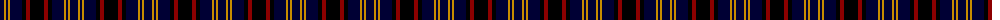
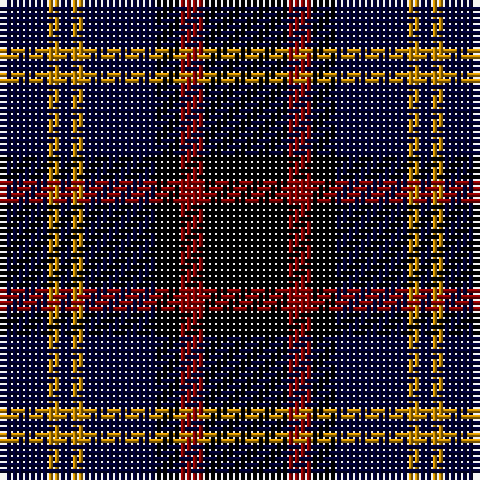

The parent of this is [Printing Industries of America (Corp](/tartans/db/8/dy2/db2/dy2/db12/k4/dr4/k/14/)

This was sourced from tartans-authority.  It is a [8 stripes tartan](/stripes/stripes8/).

Original link http://www.tartansauthority.com/tartan-ferret/display/5446/

## Thread count
DB/8 DY2 DB2 DY2 DB12 K4 DR4 K/14

## Palette
Each colour and its ΔE from the base-6 reference it is a variant of.

| Colour | Shade | Base | ΔE (OKLab) |
|---|---|---|---|
| DB |  `#000034` | K  | 0.18 |
| DR |  `#8C0000` | R  | 0.13 |
| DY |  `#C88C00` | Y  | 0.15 |
| K |  `#000000` | K  | 0.00 |

# Sample pattern

ID: /variants/db/8/dy2/db2/dy2/db12/k4/dr4/k/14-db000034-dr8c0000-dyc88c00-k000000/
