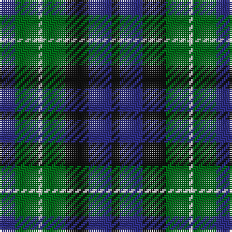

The parent of this is [MacNeil of Colonsay Clan Tartan Tartan Number: 196. Earliest known date: 1906 This sett is the usual modern form that appeared in Johnston's publication of 1906. MacNeil tartans had been produced by Wilson's of Bannockburn since the earliest pattern book of 1819 and various changes were made to the sett. The present form of the tartan appears to be developed from Wilson's early samples. It is substantially different from the certified version in the Highland Society of London collection. See products available Copyright © Blair Urquhart, Comrie, 2015](/tartans/db/8/g12/ln2/g12/k12/db12/k/4/)

This was sourced from house-of-tartan.  It is a [7 stripes tartan](/stripes/stripes7/).

Original link http://www.house-of-tartan.scotland.net/house/TartanViewjs.asp?colr=Def&tnam=196

## Thread count
DB/8 G12 LN2 G12 K12 DB12 K/4

## Palette
Each colour and its ΔE from the base-6 reference it is a variant of.

| Colour | Shade | Base | ΔE (OKLab) |
|---|---|---|---|
| DB |  `#2C2C80` | B  | 0.05 |
| G |  `#006818` | G  | 0.02 |
| K |  `#101010` | K  | 0.17 |
| LN |  `#E0E0E0` | W  | 0.06 |

# Sample pattern

ID: /variants/db/8/g12/ln2/g12/k12/db12/k/4-db2c2c80-g006818-k101010-lne0e0e0/
