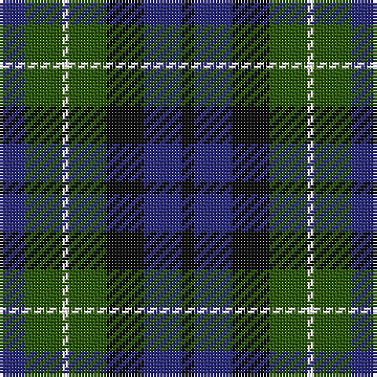

The parent of this is [MacNeil of Colonsay](/tartans/db/8/g12/w2/g12/k12/db12/k/4/)

This was sourced from register-of-tartans.  It is a [7 stripes tartan](/stripes/stripes7/).

Original link https://www.tartanregister.gov.uk/tartanDetails.aspx?ref=2687

## Thread count
DB/8 G12 W2 G12 K12 DB12 K/4

## Palette
Each colour and its ΔE from the base-6 reference it is a variant of.

| Colour | Shade | Base | ΔE (OKLab) |
|---|---|---|---|
| DB |  `#2C2C80` | B  | 0.05 |
| G |  `#285800` | G  | 0.04 |
| K |  `#101010` | K  | 0.17 |
| W |  `#FFFFFF` | W  | 0.03 |

# Sample pattern

ID: /variants/db/8/g12/w2/g12/k12/db12/k/4-db2c2c80-g285800-k101010-wffffff/
