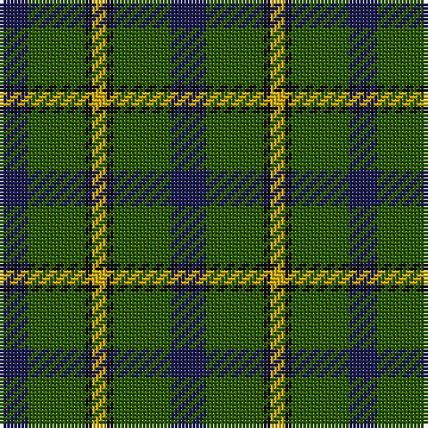

The parent of this is [Salvation Army Htg (Corporate)](/tartans/db/8/g16/k2/y4/k2/g16/db/10/)

This was sourced from tartans-authority.  It is a [7 stripes tartan](/stripes/stripes7/).

Original link http://www.tartansauthority.com/tartan-ferret/display/150/

## Thread count
DB/8 G16 K2 Y4 K2 G16 DB/10

## Palette
Each colour and its ΔE from the base-6 reference it is a variant of.

| Colour | Shade | Base | ΔE (OKLab) |
|---|---|---|---|
| DB |  `#1C1C50` | B  | 0.14 |
| G |  `#285800` | G  | 0.04 |
| K |  `#101010` | K  | 0.17 |
| Y |  `#CCA800` | Y  | 0.08 |

# Sample pattern

ID: /variants/db/8/g16/k2/y4/k2/g16/db/10-db1c1c50-g285800-k101010-ycca800/
