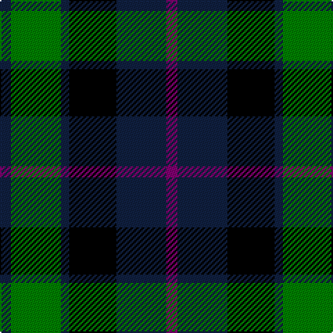

The parent of this is [Scottish Airports](/tartans/db/8/g36/db6/k34/db36/p/8/)

This was sourced from weddslist.  It is a [6 stripes tartan](/stripes/stripes6/).

Original link http://www.weddslist.com/cgi-bin/tartans/pg.pl?source=sts

## Thread count
DB/8 G36 DB6 K34 DB36 P/8

## Palette
Each colour and its ΔE from the base-6 reference it is a variant of.

| Colour | Shade | Base | ΔE (OKLab) |
|---|---|---|---|
| DB |  `#102040` | B  | 0.15 |
| G |  `#008000` | G  | 0.09 |
| K |  `#000000` | K  | 0.00 |
| P |  `#800070` | B  | 0.17 |

# Sample pattern

ID: /variants/db/8/g36/db6/k34/db36/p/8-db102040-g008000-k000000-p800070/
