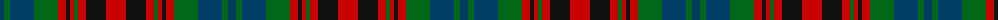

The parent of this is [Hueg (Personal)](/tartans/db/8/g6/db24/g24/r8/k4/r4/g4/r8/k20/r/20/)

This was sourced from tartans-authority.  It is a [11 stripes tartan](/stripes/stripes11/).

Original link http://www.tartansauthority.com/tartan-ferret/display/10523/

## Thread count
DB/8 G6 DB24 G24 R8 K4 R4 G4 R8 K20 R/20

## Palette
Each colour and its ΔE from the base-6 reference it is a variant of.

| Colour | Shade | Base | ΔE (OKLab) |
|---|---|---|---|
| DB |  `#003C64` | B  | 0.07 |
| G |  `#006818` | G  | 0.02 |
| K |  `#101010` | K  | 0.17 |
| R |  `#C80000` | R  | 0.00 |

ID: /variants/db/8/g6/db24/g24/r8/k4/r4/g4/r8/k20/r/20-db003c64-g006818-k101010-rc80000/
