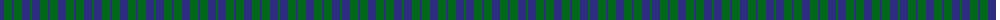
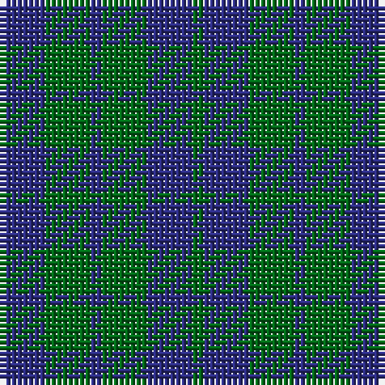

The parent of this is [Highland Grey](/tartans/db/8/g8/db2/g8/db8/g/2/)

This was sourced from tartans-authority.  It is a [6 stripes tartan](/stripes/stripes6/).

Original link http://www.tartansauthority.com/tartan-ferret/display/9001/

## Thread count
DB/8 G8 DB2 G8 DB8 G/2

## Palette
Each colour and its ΔE from the base-6 reference it is a variant of.

| Colour | Shade | Base | ΔE (OKLab) |
|---|---|---|---|
| DB |  `#2C2C80` | B  | 0.05 |
| G |  `#006818` | G  | 0.02 |

# Sample pattern

ID: /variants/db/8/g8/db2/g8/db8/g/2-db2c2c80-g006818/
