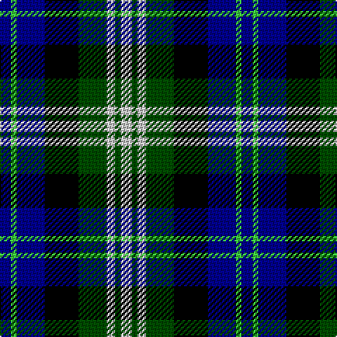

The parent of this is [Business Air Corporate Tartan Tartan Number: 2328. Earliest known date: 1993 Estimated from observation; the airline has been using this tartan since November 1993. See products available Copyright © Blair Urquhart, Comrie, 2015](/tartans/db/8/ga4/db20/k24/g20/n6/g4/n/8/)

This was sourced from house-of-tartan.  It is a [8 stripes tartan](/stripes/stripes8/).

Original link http://www.house-of-tartan.scotland.net/house/TartanViewjs.asp?colr=Def&tnam=2328

## Thread count
DB/8 Ga4 DB20 K24 G20 N6 G4 N/8

## Palette
Each colour and its ΔE from the base-6 reference it is a variant of.

| Colour | Shade | Base | ΔE (OKLab) |
|---|---|---|---|
| DB |  `#00008C` | B  | 0.13 |
| G |  `#004C00` | G  | 0.08 |
| Ga |  `#3CC83C` | Y  | 0.19 |
| K |  `#000000` | K  | 0.00 |
| N |  `#C8C8C8` | W  | 0.13 |

# Sample pattern

ID: /variants/db/8/ga4/db20/k24/g20/n6/g4/n/8-db00008c-g004c00-ga3cc83c-k000000-nc8c8c8/
