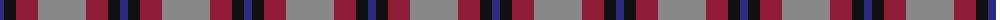
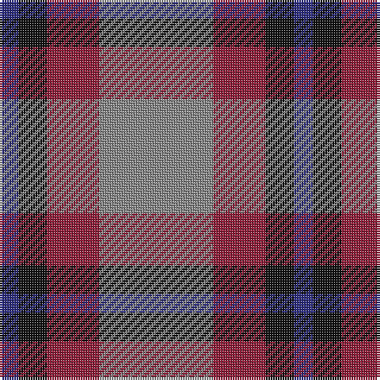

The parent of this is [Nebar (Corporate)](/tartans/db/8/k12/dr22/n/48/)

This was sourced from tartans-authority.  It is a [4 stripes tartan](/stripes/stripes4/).

Original link http://www.tartansauthority.com/tartan-ferret/display/8517/

## Thread count
DB/8 K12 DR22 N/48

## Palette
Each colour and its ΔE from the base-6 reference it is a variant of.

| Colour | Shade | Base | ΔE (OKLab) |
|---|---|---|---|
| DB |  `#2C2C80` | B  | 0.05 |
| DR |  `#901C38` | R  | 0.12 |
| K |  `#101010` | K  | 0.17 |
| N |  `#888888` | R  | 0.24 |

# Sample pattern

ID: /variants/db/8/k12/dr22/n/48-db2c2c80-dr901c38-k101010-n888888/
