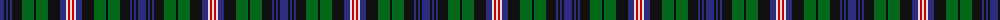

The parent of this is [Gemmell Clan Tartan Tartan Number: 3213. Earliest known date: 2001 Design copyright is owned by Thomas Kempsill Gemmell and Davina Creighton Gemmell. Designed in traditional tartan colours. See products available Copyright © Blair Urquhart, Comrie, 2015](/tartans/db/8/k2/db2/k2/db2/k10/g12/k2/g12/k12/db6/ln2/r2/ln/2/)

This was sourced from house-of-tartan.  It is a [14 stripes tartan](/stripes/stripes14/).

Original link http://www.house-of-tartan.scotland.net/house/TartanViewjs.asp?colr=Def&tnam=3213

## Thread count
DB/8 K2 DB2 K2 DB2 K10 G12 K2 G12 K12 DB6 LN2 R2 LN/2

## Palette
Each colour and its ΔE from the base-6 reference it is a variant of.

| Colour | Shade | Base | ΔE (OKLab) |
|---|---|---|---|
| DB |  `#2C2C80` | B  | 0.05 |
| G |  `#006818` | G  | 0.02 |
| K |  `#101010` | K  | 0.17 |
| LN |  `#E0E0E0` | W  | 0.06 |
| R |  `#C80000` | R  | 0.00 |

ID: /variants/db/8/k2/db2/k2/db2/k10/g12/k2/g12/k12/db6/ln2/r2/ln/2-db2c2c80-g006818-k101010-lne0e0e0-rc80000/
