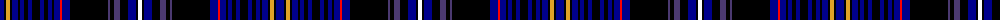

The parent of this is [Arnold (California)](/tartans/db/8/k2/y4/k2/db6/k2/db4/k4/db4/k8/db4/k4/db4/k2/db6/r2/db8/k38/dba2/k4/dba6/k8/db8/k2/w/4/)

This was sourced from register-of-tartans.  It is a [25 stripes tartan](/stripes/stripes25/).

Original link https://www.tartanregister.gov.uk/tartanDetails.aspx?ref=10751

## Thread count
DB/8 K2 Y4 K2 DB6 K2 DB4 K4 DB4 K8 DB4 K4 DB4 K2 DB6 R2 DB8 K38 DBa2 K4 DBa6 K8 DB8 K2 W/4

## Palette
Each colour and its ΔE from the base-6 reference it is a variant of.

| Colour | Shade | Base | ΔE (OKLab) |
|---|---|---|---|
| DB |  `#00008C` | B  | 0.13 |
| DBa |  `#4B3971` | B  | 0.06 |
| K |  `#000000` | K  | 0.00 |
| R |  `#FF0000` | R  | 0.11 |
| W |  `#FFFFFF` | W  | 0.03 |
| Y |  `#E0A126` | Y  | 0.08 |

ID: /variants/db/8/k2/y4/k2/db6/k2/db4/k4/db4/k8/db4/k4/db4/k2/db6/r2/db8/k38/dba2/k4/dba6/k8/db8/k2/w/4-db00008c-dba4b3971-k000000-rff0000-wffffff-ye0a126/
