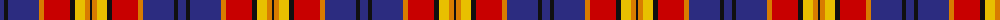

The parent of this is [McGurk (Personal)](/tartans/db/8/k4/db31/o5/r26/k5/y10/o5/k/2/)

This was sourced from tartans-authority.  It is a [9 stripes tartan](/stripes/stripes9/).

Original link http://www.tartansauthority.com/tartan-ferret/display/7159/

## Thread count
DB/8 K4 DB31 O5 R26 K5 Y10 O5 K/2

## Palette
Each colour and its ΔE from the base-6 reference it is a variant of.

| Colour | Shade | Base | ΔE (OKLab) |
|---|---|---|---|
| DB |  `#2C2C80` | B  | 0.05 |
| K |  `#101010` | K  | 0.17 |
| O |  `#D87C00` | Y  | 0.17 |
| R |  `#C80000` | R  | 0.00 |
| Y |  `#E8C000` | Y  | 0.00 |

ID: /variants/db/8/k4/db31/o5/r26/k5/y10/o5/k/2-db2c2c80-k101010-od87c00-rc80000-ye8c000/
