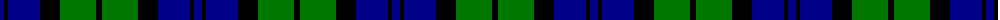
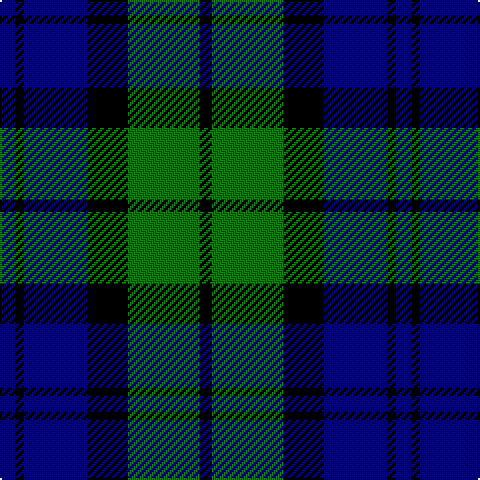

The parent of this is [Wartley Htg (Fashion)](/tartans/db/8/k4/db32/k20/g36/k/6/)

This was sourced from tartans-authority.  It is a [6 stripes tartan](/stripes/stripes6/).

Original link http://www.tartansauthority.com/tartan-ferret/display/4338/

## Thread count
DB/8 K4 DB32 K20 G36 K/6

## Palette
Each colour and its ΔE from the base-6 reference it is a variant of.

| Colour | Shade | Base | ΔE (OKLab) |
|---|---|---|---|
| DB |  `#000088` | B  | 0.14 |
| G |  `#007800` | G  | 0.06 |
| K |  `#000000` | K  | 0.00 |

# Sample pattern

ID: /variants/db/8/k4/db32/k20/g36/k/6-db000088-g007800-k000000/
