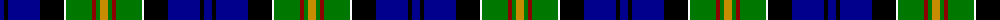

The parent of this is [Cusack Clan/Family Tartan Tartan Number: 4649. Earliest known date: 2002 Designed by Peter MacDonald for Jeremy Cusack, Guernsey, Channel Isles. Copyright Peter MacDonald but can be worn by all Cusacks. See products available Copyright © Blair Urquhart, Comrie, 2015](/tartans/db/8/k4/db32/k24/w2/g26/dr4/g4/dy/8/)

This was sourced from house-of-tartan.  It is a [9 stripes tartan](/stripes/stripes9/).

Original link http://www.house-of-tartan.scotland.net/house/TartanViewjs.asp?colr=Def&tnam=4649

## Thread count
DB/8 K4 DB32 K24 W2 G26 DR4 G4 DY/8

## Palette
Each colour and its ΔE from the base-6 reference it is a variant of.

| Colour | Shade | Base | ΔE (OKLab) |
|---|---|---|---|
| DB |  `#00008C` | B  | 0.13 |
| DR |  `#8C0000` | R  | 0.13 |
| DY |  `#C88C00` | Y  | 0.15 |
| G |  `#007800` | G  | 0.06 |
| K |  `#000000` | K  | 0.00 |
| W |  `#FCFCFC` | W  | 0.03 |

ID: /variants/db/8/k4/db32/k24/w2/g26/dr4/g4/dy/8-db00008c-dr8c0000-dyc88c00-g007800-k000000-wfcfcfc/
