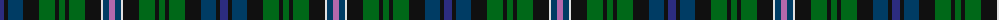

The parent of this is [Free (Universal)](/tartans/db/8/k4/dba15/k16/g16/k4/g6/k4/g16/k16/ln2/dba6/p/6/)

This was sourced from tartans-authority.  It is a [13 stripes tartan](/stripes/stripes13/).

Original link http://www.tartansauthority.com/tartan-ferret/display/10156/

## Thread count
DB/8 K4 DBa15 K16 G16 K4 G6 K4 G16 K16 LN2 DBa6 P/6

## Palette
Each colour and its ΔE from the base-6 reference it is a variant of.

| Colour | Shade | Base | ΔE (OKLab) |
|---|---|---|---|
| DB |  `#2C2C80` | B  | 0.05 |
| DBa |  `#003C64` | B  | 0.07 |
| G |  `#006818` | G  | 0.02 |
| K |  `#101010` | K  | 0.17 |
| LN |  `#E0E0E0` | W  | 0.06 |
| P |  `#B468AC` | R  | 0.21 |

ID: /variants/db/8/k4/dba15/k16/g16/k4/g6/k4/g16/k16/ln2/dba6/p/6-db2c2c80-dba003c64-g006818-k101010-lne0e0e0-pb468ac/
