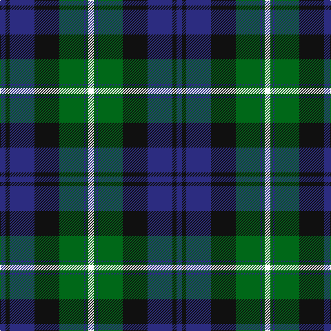

The parent of this is [Dress Watch (Fashion) Fashion Tartan Tartan Number: 6069. Earliest known date: Nov 2003 Introduced as a fashion tartan by the House of Edgar to provide a photogenic pattern similar to the Black Watch. See products available Copyright © Blair Urquhart, Comrie, 2015](/tartans/db/8/k6/db36/k36/g36/db2/g4/w/8/)

This was sourced from house-of-tartan.  It is a [8 stripes tartan](/stripes/stripes8/).

Original link http://www.house-of-tartan.scotland.net/house/TartanViewjs.asp?colr=Def&tnam=6069

## Thread count
DB/8 K6 DB36 K36 G36 DB2 G4 W/8

## Palette
Each colour and its ΔE from the base-6 reference it is a variant of.

| Colour | Shade | Base | ΔE (OKLab) |
|---|---|---|---|
| DB |  `#2C2C80` | B  | 0.05 |
| G |  `#006818` | G  | 0.02 |
| K |  `#101010` | K  | 0.17 |
| W |  `#FCFCFC` | W  | 0.03 |

# Sample pattern

ID: /variants/db/8/k6/db36/k36/g36/db2/g4/w/8-db2c2c80-g006818-k101010-wfcfcfc/
