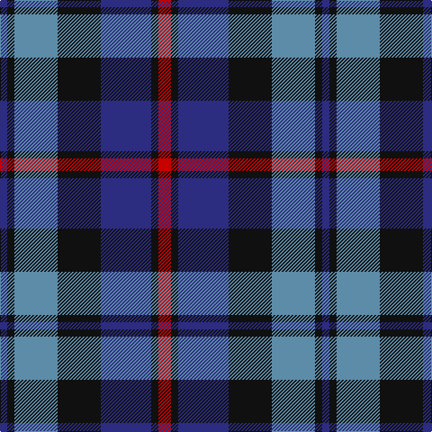

The parent of this is [MacCorquodale Clan Tartan Tartan Number: 283. Earliest known date: 1981 Sample in the Tartans Society collection given to them in 1981 by Kinloch Anderson of Edinburgh. probably woven by DC. Dalgliesh. See also 2079 the Argyll District tartan with black guards on the red and green in place of the azure (the lighter blue shade). The MacCorquodales lands north of Loch Awe border on the Campbell territory centered on Inveraray. See products available Copyright © Blair Urquhart, Comrie, 2015](/tartans/db/8/k8/b48/k48/db56/k8/r/14/)

This was sourced from house-of-tartan.  It is a [7 stripes tartan](/stripes/stripes7/).

Original link http://www.house-of-tartan.scotland.net/house/TartanViewjs.asp?colr=Def&tnam=283

## Thread count
DB/8 K8 B48 K48 DB56 K8 R/14

## Palette
Each colour and its ΔE from the base-6 reference it is a variant of.

| Colour | Shade | Base | ΔE (OKLab) |
|---|---|---|---|
| B |  `#5C8CA8` | B  | 0.23 |
| DB |  `#2C2C80` | B  | 0.05 |
| K |  `#101010` | K  | 0.17 |
| R |  `#C80000` | R  | 0.00 |

# Sample pattern

ID: /variants/db/8/k8/b48/k48/db56/k8/r/14-b5c8ca8-db2c2c80-k101010-rc80000/
