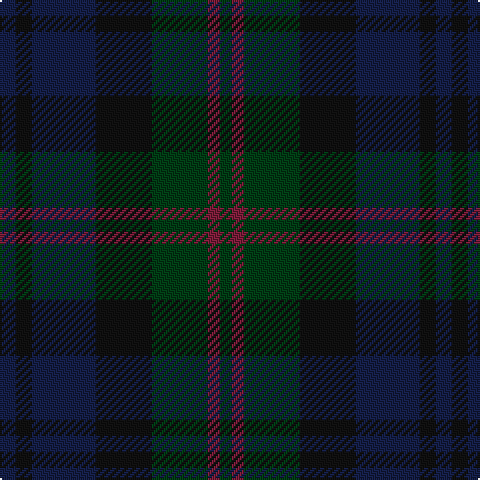

The parent of this is [Inneryne (Personal)](/tartans/db/8/k8/db32/k28/dg28/dr6/dg/6/)

This was sourced from register-of-tartans.  It is a [7 stripes tartan](/stripes/stripes7/).

Original link https://www.tartanregister.gov.uk/tartanDetails.aspx?ref=5987

## Thread count
DB/8 K8 DB32 K28 DG28 DR6 DG/6

## Palette
Each colour and its ΔE from the base-6 reference it is a variant of.

| Colour | Shade | Base | ΔE (OKLab) |
|---|---|---|---|
| DB |  `#141E46` | B  | 0.15 |
| DG |  `#003C14` | G  | 0.14 |
| DR |  `#781C38` | R  | 0.17 |
| K |  `#101010` | K  | 0.17 |

# Sample pattern

ID: /variants/db/8/k8/db32/k28/dg28/dr6/dg/6-db141e46-dg003c14-dr781c38-k101010/
