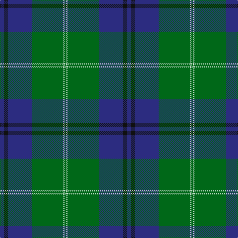

The parent of this is [Oliphant (Clan)](/tartans/db/8/k8/db48/g64/w2/g/4/)

This was sourced from tartans-authority.  It is a [6 stripes tartan](/stripes/stripes6/).

Original link http://www.tartansauthority.com/tartan-ferret/display/242/

## Thread count
DB/8 K8 DB48 G64 W2 G/4

## Palette
Each colour and its ΔE from the base-6 reference it is a variant of.

| Colour | Shade | Base | ΔE (OKLab) |
|---|---|---|---|
| DB |  `#2C2C80` | B  | 0.05 |
| G |  `#006818` | G  | 0.02 |
| K |  `#101010` | K  | 0.17 |
| W |  `#FCFCFC` | W  | 0.03 |

# Sample pattern

ID: /variants/db/8/k8/db48/g64/w2/g/4-db2c2c80-g006818-k101010-wfcfcfc/
