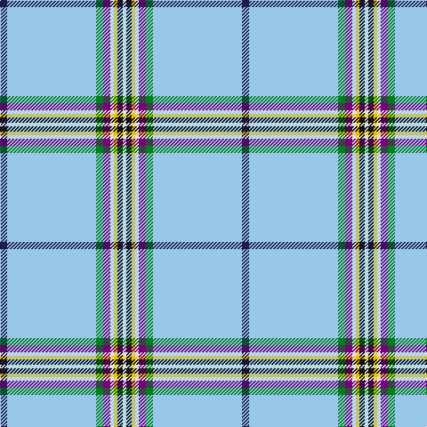

The parent of this is [Glasgow Islay (Fashion)](/tartans/db/8/lb100/g8/p8/ln4/y4/k6/ln/4/)

This was sourced from tartans-authority.  It is a [8 stripes tartan](/stripes/stripes8/).

Original link http://www.tartansauthority.com/tartan-ferret/display/10217/

## Thread count
DB/8 LB100 G8 P8 LN4 Y4 K6 LN/4

## Palette
Each colour and its ΔE from the base-6 reference it is a variant of.

| Colour | Shade | Base | ΔE (OKLab) |
|---|---|---|---|
| DB |  `#1C1C50` | B  | 0.14 |
| G |  `#00801C` | G  | 0.09 |
| K |  `#101010` | K  | 0.17 |
| LB |  `#98C8E8` | W  | 0.17 |
| LN |  `#E0E0E0` | W  | 0.06 |
| P |  `#780078` | B  | 0.16 |
| Y |  `#E8C000` | Y  | 0.00 |

# Sample pattern

ID: /variants/db/8/lb100/g8/p8/ln4/y4/k6/ln/4-db1c1c50-g00801c-k101010-lb98c8e8-lne0e0e0-p780078-ye8c000/
