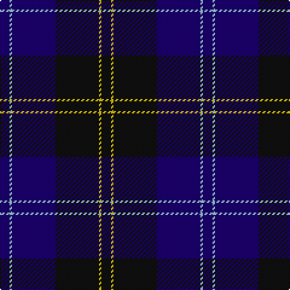

The parent of this is [Lyndon Prep (School)](/tartans/db/8/lb2/db36/k36/y2/k/8/)

This was sourced from tartans-authority.  It is a [6 stripes tartan](/stripes/stripes6/).

Original link http://www.tartansauthority.com/tartan-ferret/display/8074/

## Thread count
DB/8 LB2 DB36 K36 Y2 K/8

## Palette
Each colour and its ΔE from the base-6 reference it is a variant of.

| Colour | Shade | Base | ΔE (OKLab) |
|---|---|---|---|
| DB |  `#1C0070` | B  | 0.14 |
| K |  `#101010` | K  | 0.17 |
| LB |  `#98C8E8` | W  | 0.17 |
| Y |  `#E8C000` | Y  | 0.00 |

# Sample pattern

ID: /variants/db/8/lb2/db36/k36/y2/k/8-db1c0070-k101010-lb98c8e8-ye8c000/
